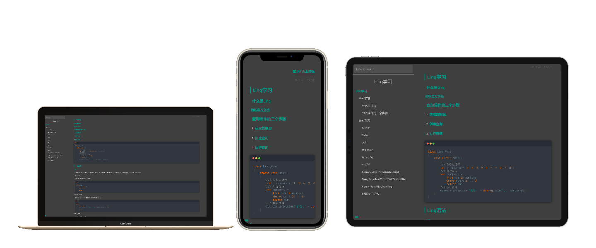

# 关于此电子书框架
>本框架是基于docify定制的一个电子书框架。适配手机端，pc端。



## 特性
- 暗黑模式，绿色标题，灰白字体。
- 代码引用使用mac窗体风格。
- 代码高亮。
- 文章字数统计。
- GitHub上快链打开编辑。

## 如何开始？
1. Clone此项目。或者使用命令
   ```
   git clone https://github.com/wemanclh/docvi.git
   ```
2. 打开index.html配置基础信息。
   ```javascript
    window.$docsify = {
      search: 'auto',
      search:{
        // 支持本地化
        placeholder: {
          '/zh-cn/': '搜索',
          '/': '搜索'
        },
        // 支持本地化
        noData: {
          '/zh-cn/': '找不到结果',
          '/': '找不到结果'
        },
      },
      //字数统计
      count:{
        countable:true,
        fontsize:'0.9em',
        color:'rgb(90,90,90)',
        language:'chinese'
      },
      plugins: [
      EditOnGithubPlugin.create("https://github.com/wemanclh/doc/blob/main/", null, "在Github上编辑")
      ],
      loadSidebar: true,
      subMaxLevel: 2,
      name: '这是标题',
      repo: ''
    }
   ```
3. 打开_sidebar.md配置左侧菜单。
   ```markdown
    <!-- docs/_sidebar.md -->
    * [主页](ReadMe)
    * [一级标题1](section1.md)
    * [一级标题2](section2.md)
    * [一级标题3](section3.md)
   ```
4. 使用markdown撰写文章。
   markdown语法详见：[5分钟入门markdown](https://www.runoob.com/markdown/md-tutorial.html)
## 本地预览
1. 推荐全局安装 **docsify-cli** 工具，可以方便地创建及在本地预览生成的文档。
   ```
   npm i docsify-cli -g
   ```
2. 通过运行 docsify serve 启动一个本地服务器，可以方便地实时预览效果。默认访问地址 http://localhost:3000 。
   ```
   docsify serve docs
   ```